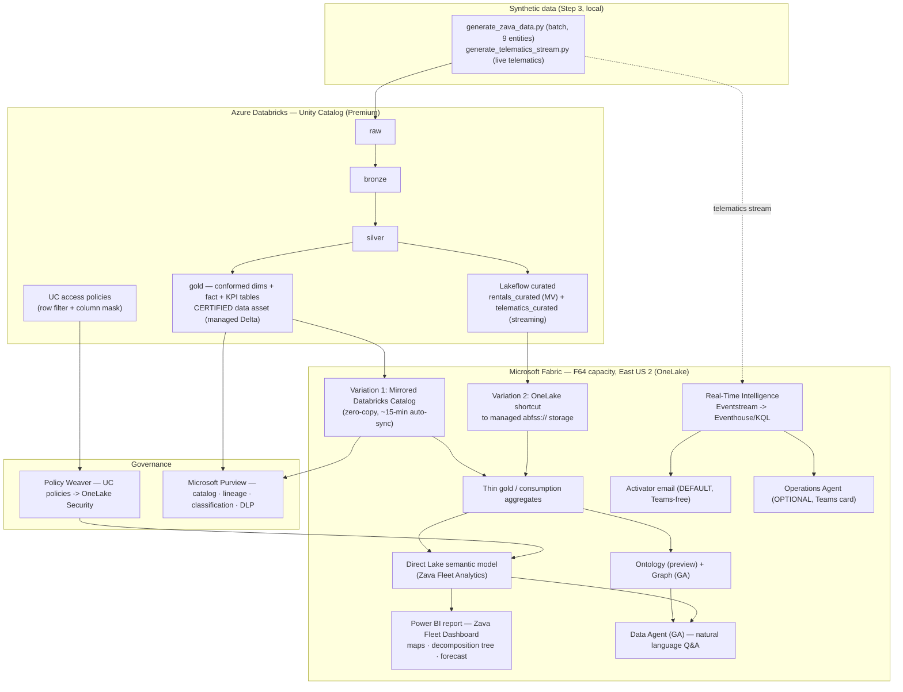

# Zava — Architecture

How **Azure Databricks** and **Microsoft Fabric** combine into a modern, governed data
foundation for **Zava**, a fictional US car-rental company headquartered in Seattle. This
document is for a **mixed audience** — data engineers, BI/business users, and decision makers.
It explains *what* gets built, *how the pieces connect*, and *why it matters to the business*.

> **Everything is synthetic.** All people, plates, VINs, and "PII-like" fields are fabricated.
> The demo is a **public, reusable** blueprint a customer can redeploy in their own environment.

---

## 1. The big picture

The demo wires four equal-weight pillars on top of one certified data asset:

1. **No-copy mirroring** — mirror Databricks Unity Catalog gold into Fabric **OneLake** (zero
   ETL, near-real-time).
2. **Direct Lake reporting** — Power BI **Direct Lake** over that data, with a thin
   consumption-layer calculation feeding an impressive report.
3. **Ontology insights** — a Fabric semantic/**ontology** layer over the business entities for
   **natural-language** insights (a **Data Agent**) beyond Power BI.
4. **Governance** — **Policy Weaver** syncs Databricks access policies into Fabric, and
   **Microsoft Purview** provides end-to-end lineage, classification, and DLP.

The Databricks medallion (raw → bronze → silver → gold → **certified asset**) is intentionally
**simple** — it's the setup. The **integration + Fabric side is the star**.

---

## 2. Layered flow (end to end)



Reading the flow:

1. **Synthetic data** is generated locally (Step 3) and landed into Databricks **raw**.
2. The **medallion** cleans and conforms it up to a **certified gold** asset.
3. A **Lakeflow** pipeline produces **curated** managed tables (the Variation-2 source).
4. Fabric ingests via **two variations** (below) into **OneLake**.
5. A **thin gold** consumption layer aggregates report-ready KPIs.
6. **Direct Lake** powers the **report**; the **ontology + Data Agent** power natural-language
   insight; **Real-Time Intelligence** powers **watch-and-act** alerting.
7. **Policy Weaver + Purview** keep the whole thing governed end to end.

---

## 3. The two ingestion variations

The demo shows **both** Fabric ingestion patterns side by side because they have different
trade-offs:

| | **Variation 1 — Mirror** | **Variation 2 — Managed-storage shortcut** |
|---|---|---|
| Source | Certified **gold** (managed Delta) | Lakeflow **curated** (streaming table + materialized view) |
| Why this pattern | Managed Delta **is** mirrorable | Streaming tables / MVs are **excluded from mirroring** (R10 §2.3) |
| Mechanism | **Mirrored Azure Databricks Catalog** — zero-copy metadata mirror, ~15-min auto-sync | **OneLake shortcut** onto the Databricks-managed `abfss://` storage that backs the table (sub-pattern **2A**) |
| Governance | UC policies sync into Fabric via **Policy Weaver** | UC policies **do not** follow the data through a storage shortcut — **re-enforce in Fabric** (OneLake security + storage RBAC) |
| Cleaner option | — | **Sub-pattern 2B**: Lakeflow sink to an **owned external location** → stable path + clean boundary |

The Variation-2 **governance seam** (a direct-storage shortcut bypassing UC enforcement at the
storage layer) is called out explicitly and mitigated in
[`runbook-end-to-end.md`](./runbook-end-to-end.md). This is intentional: it shows customers the
real trade-off and how to close it.

---

## 4. Direct Lake reporting

**Direct Lake** reads OneLake Delta files **directly** — no import refresh, no DirectQuery
round-trips to a database. The **thin gold** layer (`fabric/scripts/40_build_thin_gold.py`)
pre-aggregates KPIs (revenue by site, fleet utilization, one-way flows, idle vehicles,
maintenance cost) so the **semantic model** (`Zava Fleet Analytics`) stays fast and simple. The
**Power BI report** (`Zava Fleet Dashboard`) renders the wow-factors:

- a **multi-city map** of Zava sites (lat/long from the synthetic `Sites`),
- a **decomposition tree** of revenue,
- a **revenue forecast**, and
- an executive KPI overview — all in the **blue Zava theme**.

Row-level security (`CityManager` role in the semantic model) mirrors the Databricks row filter,
so a constrained user sees consistent restrictions across the report.

---

## 5. Fabric IQ — ontology, graph, and agents

"Insights beyond Power BI" is delivered by **Fabric IQ**:

| Capability | Maturity | Role in the demo |
|---|---|---|
| **Ontology** | **Preview** (GA imminent) | A semantic model of Zava's business entities (sites, vehicles, customers, rentals) — the **only preview item** in the demo. |
| **Graph** | **GA** | Auto-created from the ontology; the structure the Data Agent reasons over. |
| **Data Agent** | **GA** | Natural-language Q&A over the semantic model + graph. The same business question answers **identically** across a Power BI measure, the Data Agent, and an ontology query. |
| **Operations Agent** | **GA** | The optional watch+act enhancement (see §6). |

Because Ontology is the only preview piece, the demo has a **GA-only fallback**: semantic model
+ report + Data Agent + Activator email alerting are **all GA** and deliver the story even if
Ontology is unavailable.

---

## 6. Real-time watch-and-act

The telematics generator can inject a **bounded spike window** (`idle_minutes > 120` and/or a
fault code). That feed flows **Eventstream → Eventhouse/KQL** (Real-Time Intelligence), and two
watch+act paths react:

- **Default — Activator email (Teams-free).** A Fabric **Activator** rule
  (`78_create_activator_email.py`) emails the site manager when the spike crosses the threshold.
  This is **code-deployable** and needs **no Teams** — the path everyone gets by default
  (`enable_activator_email=true`).
- **Optional — Operations Agent (Teams).** When `enable_operations_agent=true`, the
  **Operations Agent** (`80_create_operations_agent.py`) adds LLM-reasoned, concept-aware
  recommendations via a human-in-the-loop **Teams Yes/No** card. This is the only path that
  requires Teams, and it carries a region exclusion (see §8).

---

## 7. Governance — Policy Weaver + Purview

Two governance layers run end to end:

- **Policy Weaver** (`scripts/governance/policy-weaver/`) reads the Unity Catalog **row filter +
  column mask** (`databricks/uc/05_access_policies.sql`) and writes equivalent **Fabric OneLake
  Security** data-access roles — so a Seattle site manager sees only Seattle rentals, and email
  PII stays masked, **consistently** in the Direct Lake report, Data Agent, and OneLake. Mirroring
  copies *data*, not *policies*; Policy Weaver closes that gap for **Variation 1**.
- **Microsoft Purview** (`scripts/governance/purview/`) catalogs metadata + **lineage** from
  both Databricks Unity Catalog and Fabric, **auto-classifies** the synthetic customer PII, and
  carries **sensitivity labels** through the Power BI surface (DLP).

**The lineage/governance seam.** For **Variation 2**, a direct-storage shortcut bypasses UC
enforcement at the storage layer — UC RLS/CLM/ABAC do **not** follow the data, and Policy Weaver
(a mirroring feature) does **not** apply to a raw-storage shortcut. Fabric-side security
(OneLake security + storage RBAC, least-privilege Workspace Identity / service principal) is the
enforcement layer there. The architecture surfaces this seam deliberately rather than hiding it —
see the mitigations in [`runbook-end-to-end.md`](./runbook-end-to-end.md).

---

## 8. Region & capacity

- **Region: East US 2.** It is the **only US region** where **every** required capability is
  available *together* — all Fabric workloads, Mirrored Databricks Catalog, Direct Lake,
  **local** Copilot/Data Agent AI (no cross-region routing), Ontology (preview) + Graph,
  Real-Time Intelligence, the **Operations Agent (GA)**, and Azure Databricks (`plan.md` §1.7).
- **Why not the alternatives.** **East US** is rejected — the **Operations Agent is unavailable
  in East US** (R11 §8: "available in Microsoft Fabric regions, excluding South Central US and
  East US"). **South Central US** fails Ontology. **West US 2 / West US 3** support the
  Operations Agent but route Copilot/Data Agent AI to another US region (latency/cross-region
  nuance).
- **West US is the documented backup region** (all capabilities ✅ local). The config schema
  accepts `{eastus2, westus}`; the PAYG CU rate is identical, so the cost model is unchanged. See
  [`cost.md`](./cost.md) §6.
- **Capacity: F64.** The SKU that runs **all** AI/Copilot/Data Agent/ontology features (R9). The
  60-day **trial** capacity can run the **data-engineering** slice only (no Copilot / Data Agent
  / Operations Agent). F64 bills **PAYG ~$11.52/hour while Active** — **pause when idle**
  (`scripts/pause_capacity.py`). Full cost model in [`cost.md`](./cost.md).

---

## 9. Implemented file structure (no drift)

```
infra/        Bicep — F64 Fabric capacity, Premium Databricks, Access Connector,
              ADLS Gen2 (+ hardening), Key Vault; fresh-vs-existing toggles.   (README)
databricks/   UC medallion (raw->bronze->silver->gold->certified) + Lakeflow
              curated (Variation-2 source) + UC access policies; Asset Bundle. (README)
fabric/       Workspace + Variation-1 mirror + Variation-2 shortcut + thin gold
              + Direct Lake semantic model + report + ontology/graph + Data Agent
              + RTI Eventhouse/Eventstream + Activator email + Operations Agent. (README)
data/         Synthetic Zava data generators (batch + telematics stream).      (README)
scripts/      Capacity pause/resume; governance (Policy Weaver, Purview).
docs/         architecture.md (this file), cost.md, prerequisites.md,
              runbook-end-to-end.md, manual-steps.md.
```

Each major folder has its own README with run commands, parameters, and manual steps. The
narrated end-to-end run procedure is in [`runbook-end-to-end.md`](./runbook-end-to-end.md); every
UI-only action is consolidated in [`manual-steps.md`](./manual-steps.md).

---

## 10. Business value (the "why")

The tools are the medium; the value is the point.

| Value | How the architecture delivers it |
|---|---|
| **Agility** | Faster insights — zero-ETL mirroring + Direct Lake mean Zava's certified data is report-ready and answerable in natural language almost immediately, with no copy-and-transform lag. |
| **Observability** | Real-Time Intelligence + Activator turn a telematics spike into an automatic alert; Purview lineage makes pipelines and data flows visible and trackable. |
| **Efficiency** | No spaghetti of data duplication or per-tool access setup — one certified asset, mirrored once, governed once, consumed many ways (report, agent, ontology, real-time). |
| **Governance** | One set of access policies authored in Databricks is **synced** into Fabric (Policy Weaver) and catalogued/classified end to end (Purview) — consistent security from source to insight. |

The throughline: a **certified data asset** in Databricks becomes **governed business insight**
across OneLake / Fabric / Power BI — impressive, yet simple to follow.
